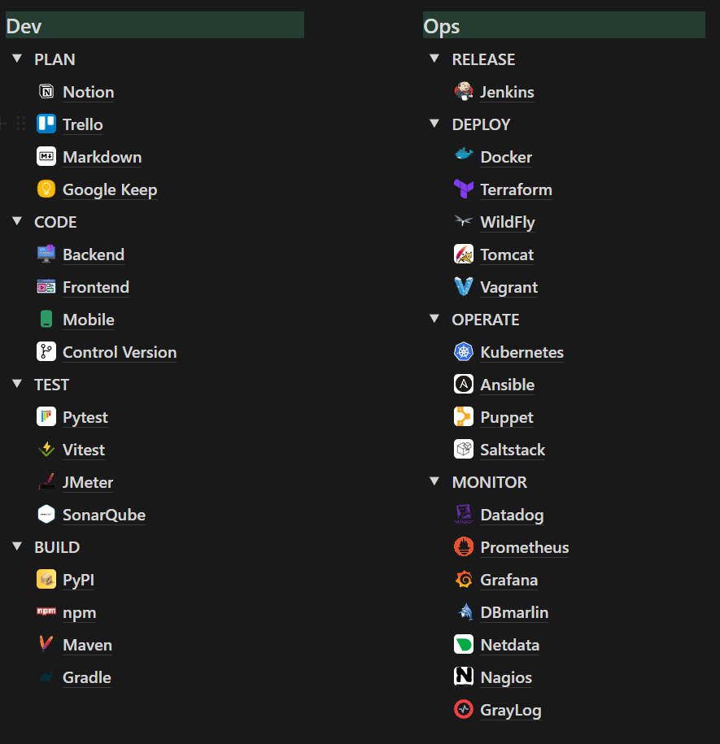

# 👋 Hello World! I'm Victor Gonzalez

  A student of Computer Engineering at the Polytechnic Faculty of the National University of Asuncion.

🎓 During this university stage I've been able to develop my skills in the areas of Development and Project Management.

I have 3 years of experience and I specialize in the field of software development where I make use of my skills and abilities in the analysis, design, creation, testing and maintenance of software.

It covers a wide range of activities and technical skills from backend to frontend where my main goal and vision is to build complete solutions as required. It is a field that I am very passionate about as it challenges, strengthens, develops and exploits my skills by testing my soft skills in both technical and non-technical problem solving and helps me to constantly learn something new.

#### Human languages:

- **Spanish**: Native
- **English**: Intermediate level
- **Portuguese**:  Elemental level

#### A bit of me:

- I was born in 1994, today living in Asunción - Paraguay.
- I am a computer engineering student.
- I like to learn technologies to help people in everything.
- I like to build cool and innovation projects that make an impact. 
- I'm a fan of mixing virtual solutions for real life things.

#### Get in touch:

If you want to know more about me, you can connect with me via LinkedIn, send me an email or we can even have a coffee.

Email: geekpy@hotmail.com X: https://twitter.com/vrgg01
